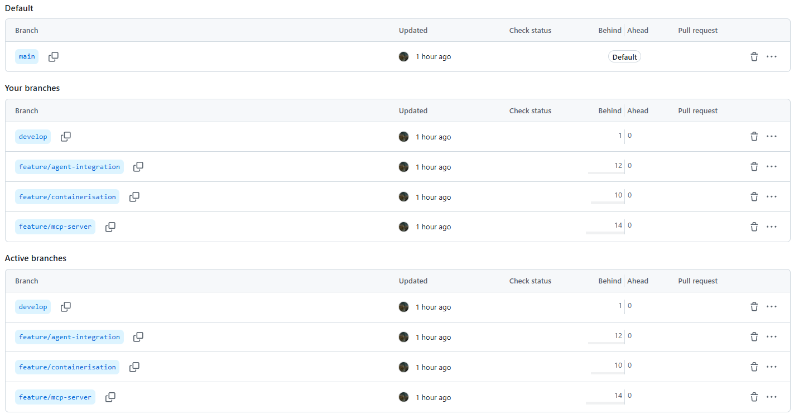
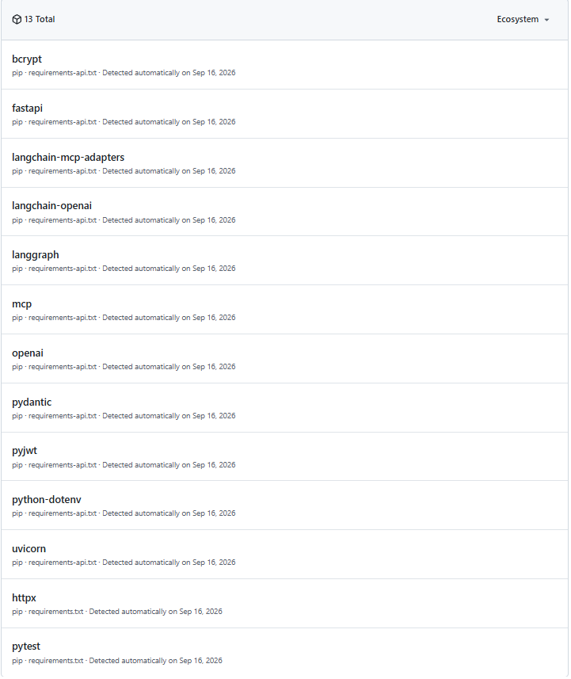
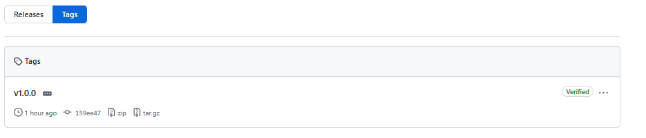

# Contributing to afyaplus-service-platform

## Branching (gitflow)

- `main` — always releasable; every commit on `main` is tagged.
- `develop` — integration branch; feature branches merge here first.
- `feature/short-description` (e.g. `feature/rate-limit-tuning`), branched
  from `develop`. One feature, one branch, merged back into `develop` with
  `git merge --no-ff` so the branch's own history stays visible in the log
  instead of being squashed away.

A branch lives **one working day, two at the absolute outside**. If it's
still open on day three, either merge what exists behind a flag or split
the remaining work into its own branch — don't let it keep drifting from
`develop`.

When a deliverable/milestone is release-ready, `develop` is merged into
`main` and the release is tagged (see Versions/Releases below).

## Commits

Atomic: one commit is one complete, logically single change (e.g. "add the
MCP server's tools" separate from "add the MCP server's tests and
evidence"). A commit should leave the test suite passing — don't split a
change so finely that an intermediate commit is broken.

## Versions

Semantic versioning (`MAJOR.MINOR.PATCH`) describes the effect on **our
callers**, not on our code:

- **MAJOR** — the request/response agreement changed in a way an existing
  caller must adapt to. Example: renaming `TriageResponse.advice` to
  `TriageResponse.guidance` would be `1.x.x -> 2.0.0`.
- **MINOR** — a caller can adopt the change but doesn't have to. Example:
  adding `POST /ask-logistics` alongside the existing `/triage` route is
  `1.0.0 -> 1.1.0`.
- **PATCH** — no visible agreement change at all. Example: `rate_limit.py`
  changing its request budget while keeping the same 429 behaviour is a
  patch, not a minor bump.

`app/main.py`'s `SERVICE_VERSION` is the single source of truth for the
current version; it must match the latest git tag.

## Releases

The **image tag** and the **git tag** must always match — `afyaplus-platform:1.0.0`
is built from, and only from, the commit tagged `v1.0.0` on `main`. To see
the exact code behind any production image:

```
git show v1.0.0
```

If that command doesn't show the code actually running, the release
process is broken and nothing else in this document can be trusted until
it's fixed.

The same gitflow shape, as seen on GitHub after pushing every branch and
the tag:







## When a merge conflict appears

1. Read both sides of every `<<<<<<<` / `=======` / `>>>>>>>` block and
   choose (or hand-merge) the correct lines — don't take "ours" or
   "theirs" wholesale without reading both. A change that merges cleanly
   can still be logically wrong; a change that conflicts can still be
   right. The two are unrelated questions.
2. Delete the conflict markers themselves. A stray `<<<<<<<` line left in
   committed code is a broken file a glance at the diff will not catch.
3. **Run the service and prove it still behaves correctly before
   committing the resolution** — the step people skip and regret. See
   `docs/MERGE_CONFLICT_LOG.md` for a worked example where both sides of a
   real conflict were individually reasonable, taking either wholesale
   would have been wrong, and `pytest tests/ -q` after resolving caught
   nothing broken but was still the right thing to run.
