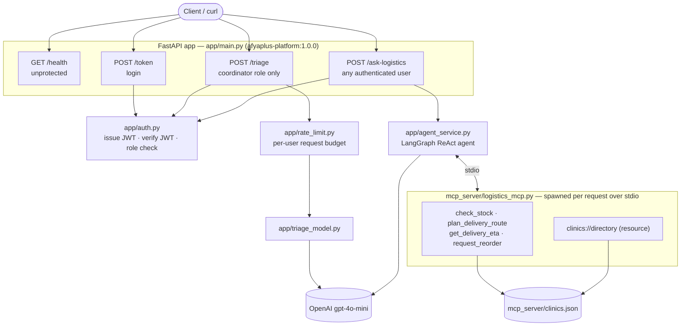

# AfyaPlus Service Platform

A production-shaped AI service platform for AfyaPlus's clinic network:
a JWT-secured FastAPI triage service wrapping a real `gpt-4o-mini` call,
containerised on a slim base image, an MCP server exposing clinic
logistics tools, and a LangChain agent over those tools behind its own
authenticated endpoint. Built for the Week 6 capstone, reusing the exact
architecture from this cohort's Week 6 Monday/Tuesday/Thursday labs
(`../afyaplus/week6_{monday,tuesday,thursday}`), re-implemented from
scratch in this standalone repo.

No fallback paths were needed: Docker Desktop and a real `OPENAI_API_KEY`
were both available, so every piece of evidence in `evidence/` is a real
run against the real running service — no stub-model or Inspector-only
substitutions.

## Architecture



One FastAPI app, one auth module enforced identically on every protected
route. `/triage` is a single real LLM call gated to the `coordinator` role;
`/ask-logistics` hands the question to a LangGraph ReAct agent, which spins
up `mcp_server/logistics_mcp.py` as a stdio subprocess per request, calls
its tools as needed, and returns once the model has enough information to
answer (or to say it can't). Both protected routes sit behind the exact
same `app/auth.py` dependency, so a bug fixed there is fixed everywhere.

For the request-by-request sequence diagrams (the 401→403→200 auth ladder,
and the full multi-tool agent trace with real timestamps) and the gitflow
diagram behind the release, see **[docs/ARCHITECTURE.md](docs/ARCHITECTURE.md)**.

## Repo layout

```
app/                  FastAPI service (Deliverable 1) + agent endpoint (Deliverable 4)
  auth.py               JWT login, current_user dependency, require_role
  rate_limit.py          per-user request budget
  models.py               typed Pydantic request/response models
  triage_model.py           real gpt-4o-mini call behind POST /triage
  agent_service.py           LangChain ReAct agent over the MCP tools
  main.py                      routes: /health /token /triage /ask-logistics
mcp_server/            MCP server (Deliverable 3)
  logistics_mcp.py       4 tools + 1 resource, input-checked, errors as data
  clinics.json             the dataset every tool reads
tests/                 offline pytest suite (23 tests, no network calls)
evidence/              captured real-run evidence for Deliverables 1/2/3/4
screenshots/           screenshot proof for every evidence item (see index below)
docs/                  engineering report pieces (Deliverable 5)
  ARCHITECTURE.md        system diagram, request-sequence diagrams, gitflow diagram (all Mermaid)
Dockerfile             Deliverable 2
deployment.yaml        read-only k8s manifest (no cluster; see brief's own fallback note)
CONTRIBUTING.md        gitflow branch policy + semver release policy
```

## Run it locally

```
python -m venv .venv
.venv/Scripts/pip install -r requirements.txt
cp .env.example .env   # fill in JWT_SECRET and OPENAI_API_KEY
uvicorn app.main:app --host 127.0.0.1 --port 8000
```

```
pytest tests/ -q          # 23 tests, offline, no billed calls
```

## Run it containerised

```
docker build -t afyaplus-platform:1.0.0 .
docker run -d -p 8000:8000 --env-file .env afyaplus-platform:1.0.0
curl http://127.0.0.1:8000/health
```

See `evidence/docker_build.md` for the full build/run/size transcript.

## Deliverable evidence index

| Deliverable | Code | Evidence | Screenshots |
|---|---|---|---|
| 1. Secure FastAPI service | `app/auth.py`, `app/models.py`, `app/triage_model.py`, `app/main.py` | `evidence/curl_transcript.md` (real 200/401/403/422), `tests/test_api.py` (8 offline tests) | `screenshots/d1-*.png` (10) |
| 2. Containerisation | `Dockerfile`, `.dockerignore`, `requirements-api.txt` | `evidence/docker_build.md` (real build, cache proof, size, runtime secret injection) | `screenshots/d2-*.png` (6) |
| 3. MCP server | `mcp_server/logistics_mcp.py` | `evidence/mcp_test_output.md` (12 tests incl. deliberate invalid calls), `logs/mcp.log` | `screenshots/d3-*.png` (2) |
| 4. Agent integration | `app/agent_service.py`, `POST /ask-logistics` in `app/main.py` | `evidence/agent_transcript.md` (real multi-tool answer + real honest refusal), `tests/test_agent_endpoint.py` | `screenshots/d4-*.png` (4) |
| 5. Engineering report | — | `CONTRIBUTING.md`, `docs/MERGE_CONFLICT_LOG.md`, `docs/TRACE_RECONSTRUCTION.md`, `docs/STAKEHOLDER_MEMO.md` | `screenshots/d5-*.png` (6) |

Every screenshot is embedded next to the exact command/output it proves in
the relevant `evidence/*.md` or `docs/*.md` file (linked above) rather than
dumped in one folder with no context — see those files for the images
inline. The full list with captions:

<details>
<summary>All 28 screenshots (click to expand)</summary>

| File | Proves |
|---|---|
| `d1-00-server-startup.png` | Uvicorn banner, "Application startup complete" |
| `d1-01-health-200.png` | `GET /health` → 200, unprotected |
| `d1-02-triage-401-no-token.png` | `POST /triage` with no token → 401 |
| `d1-03-token-422-invalid-body.png` | `POST /token` with a too-short password → 422 |
| `d1-04-token-401-wrong-password.png` | `POST /token` with the wrong password → 401 |
| `d1-05-token-guest-200.png` | `POST /token` as `guest` → 200, token issued |
| `d1-06-triage-guest-403.png` | `POST /triage` as `guest` (wrong role) → 403 |
| `d1-07-token-mercy-200.png` | `POST /token` as `mercy` → 200, token issued |
| `d1-08-triage-mercy-200-real-model.png` | `POST /triage` as `mercy` → 200, real gpt-4o-mini call |
| `d1-09-pytest-8-passed.png` | `pytest tests/test_api.py -v` → 8 passed |
| `d2-01-docker-build-full.png` | `docker build` full log, cold build |
| `d2-02-docker-images-size.png` | `docker images` — final image size |
| `d2-03-docker-build-cache-hit.png` | Rebuild after a code-only edit — `CACHED` pip layer |
| `d2-04-no-secret-baked-in.png` | Image run with no env file — `JWT_SECRET` prints `None` |
| `d2-05-container-health.png` | Containerised `/health` → 200 |
| `d2-06-container-triage-real-call.png` | Containerised `/triage` → 200, real model call |
| `d3-01-pytest-mcp-12-passed.png` | `pytest tests/test_mcp_tools.py -v` → 12 passed |
| `d3-02-mcp-log-one-line-per-call.png` | `logs/mcp.log` — one line per tool call |
| `d4-01-ask-logistics-401-no-token.png` | `POST /ask-logistics` with no token → 401 |
| `d4-02-ask-logistics-multitool-success.png` | Real multi-tool agent answer (stock + ETA chained) |
| `d4-03-ask-logistics-honest-failure.png` | Agent honestly declines a price question |
| `d4-04-pytest-agent-endpoint-3-passed.png` | `pytest tests/test_agent_endpoint.py -v` → 3 passed |
| `d5-01-git-log-graph-gitflow.png` | `git log --oneline --graph --all` — full gitflow shape |
| `d5-02-resolved-merge-conflict-commit.png` | `git show 95a393f --stat` — the resolved conflict commit |
| `d5-03-full-suite-23-passed.png` | `pytest tests/ -v` — full suite, 23 passed |
| `d5-04-github-branches.png` | GitHub branches dropdown: `main`, `develop`, `feature/*` |
| `d5-05-github-network-graph.png` | GitHub Insights → Network graph of the merge structure |
| `d5-06-github-tag.png` | GitHub Tags page showing `v1.0.0` |

</details>

## Cost actuals vs. budget

The brief budgets ~$0.10-0.40 total in real `gpt-4o-mini` calls across the
capstone. This repo's evidence was captured with:

- Deliverable 1: 2 real triage calls (`evidence/curl_transcript.md` #8,
  plus one more captured for the containerised run in
  `evidence/docker_build.md`) — within the $0.01-0.05 / 5-15 calls band.
- Deliverable 4: 5 real chat calls total across the two agent questions
  (4 for the multi-tool question's think/act/observe loop, 1 for the
  honest-refusal question) — within the $0.05-0.25 / 10-40 calls band.
- No further live calls were made once transcripts were captured; the
  offline `pytest` suite (23 tests) is what's re-run for regression
  checking, and it never touches the network.

## Development workflow

Gitflow: `main` (releasable, tagged) <- `develop` (integration) <-
`feature/*` branches, merged with `--no-ff`. See `CONTRIBUTING.md` for the
full branch/version/release policy, and `docs/MERGE_CONFLICT_LOG.md` for a
real conflict hit and resolved during this build.

## Verify the release

```
git show v1.0.0 --stat
docker images afyaplus-platform:1.0.0
```

The image tag and the git tag describe the same commit — see
`CONTRIBUTING.md`'s release policy.
