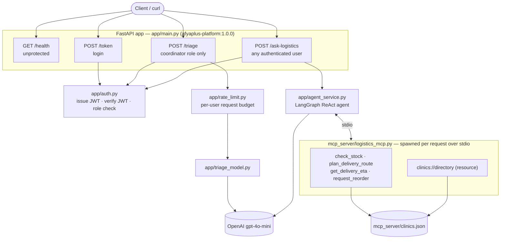
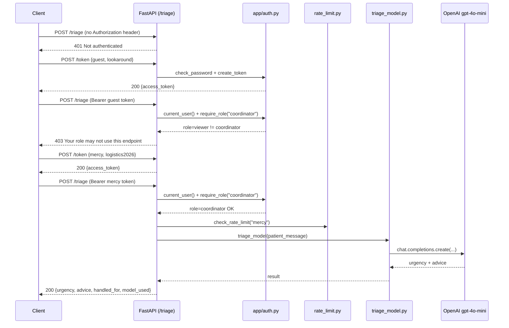
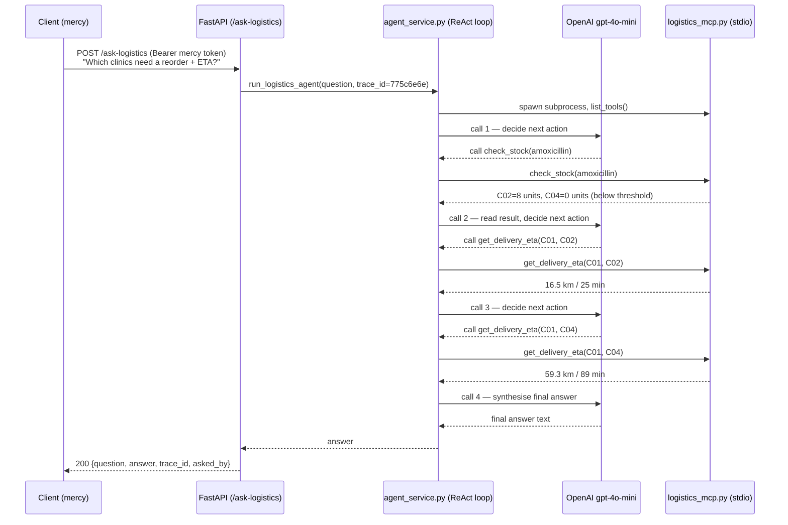
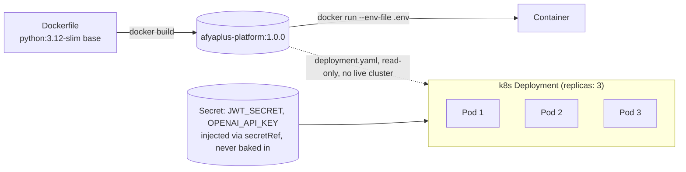
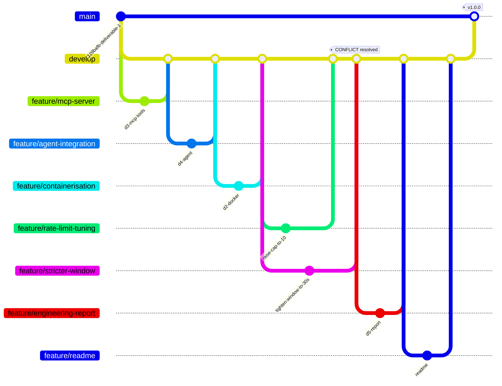

# Architecture

This is the detailed companion to the README's architecture overview: the
same system broken into its request-lifecycle sequences, plus the release
flow. Every diagram below matches a real, captured run — see the linked
evidence for the exact bytes each diagram summarizes.

## System architecture

**Component walkthrough:**

- **`app/main.py`** — the single FastAPI app. Four routes, one import of
  `app/auth.py` for every protected one, so authentication is enforced
  identically everywhere instead of re-implemented per route.
- **`app/auth.py`** — issues and verifies JWTs (`HS256`, 30-minute
  lifetime) and answers two separate questions as two separate dependency
  layers: `current_user()` (who is calling — 401 if unverifiable) and
  `require_role()` (what that identity may do — 403 if the wrong role).
- **`app/rate_limit.py`** — an in-memory per-user request budget in front
  of `/triage`, the one route that spends real money per call.
- **`app/triage_model.py`** — the single real `gpt-4o-mini` call behind
  `/triage`; a `RuntimeError` from the provider becomes a 503 the caller
  can retry, never a raw 500.
- **`app/agent_service.py`** — builds a fresh LangGraph ReAct agent per
  request: a `ChatOpenAI` model plus the MCP tools fetched through
  `MultiServerMCPClient`, which spawns `mcp_server/logistics_mcp.py` as a
  stdio child process for the lifetime of that one request.
- **`mcp_server/logistics_mcp.py`** — four tools and one resource, each
  input-validated against `clinics.json`, each bad call returned as a JSON
  `"error"` key (data an LLM can read and recover from) rather than a raised
  exception.

## Request lifecycle: the auth ladder (`/triage`)

The 401 → 403 → 200 progression exactly as captured in
[`evidence/curl_transcript.md`](../evidence/curl_transcript.md).

## Request lifecycle: the multi-tool agent (`/ask-logistics`)

Trace `775c6e6e` — the same request reconstructed with real timestamps in
[`docs/TRACE_RECONSTRUCTION.md`](TRACE_RECONSTRUCTION.md), shown here as a
sequence diagram.

Four LLM round-trips over ~11.4 seconds — matches
`logs/app.log`/`logs/mcp.log` exactly (see the trace doc for the raw log
lines). The honest-failure case (a price question) stops after `list_tools`
with zero `CallToolRequest` lines — the model looked at what was available
and correctly declined instead of guessing.

## Containerisation and deployment shape

`requirements-api.txt` is copied and installed before `app/` and
`mcp_server/` so an application-code edit only invalidates the cheap `COPY`
layers, not the ~100s `pip install` layer (proven in
[`evidence/docker_build.md`](../evidence/docker_build.md): 108s cold build,
2.3s on a code-only rebuild). `deployment.yaml` is read-only per the
brief's own fallback (no cluster this week) — its `replicas: 3` is exactly
why `app/rate_limit.py`'s in-memory counters are flagged as a risk in
[`docs/STAKEHOLDER_MEMO.md`](STAKEHOLDER_MEMO.md): three replicas each
enforcing their own limit independently lets a caller through roughly 3x
the stated budget until that state moves to a shared store.

## Release flow (gitflow)

Every `feature/*` branch is one deliverable (or one sub-change), branched
from `develop`, merged back with `--no-ff` so its own history stays
visible in `git log --graph` instead of being squashed away — see
[`d5-01-git-log-graph-gitflow.png`](../screenshots/d5-01-git-log-graph-gitflow.png).
`develop` is merged into `main` and tagged only once every deliverable is
in and the full suite passes. See
[`CONTRIBUTING.md`](../CONTRIBUTING.md) for the branch/version/release
rules and [`docs/MERGE_CONFLICT_LOG.md`](MERGE_CONFLICT_LOG.md) for the one
real conflict this history contains, resolved in full.
