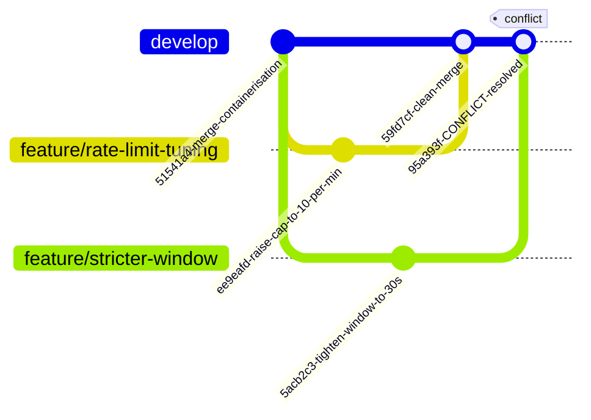
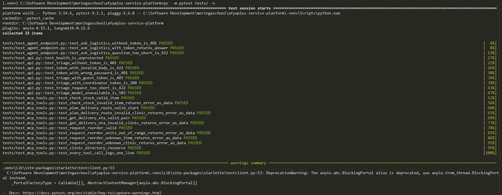
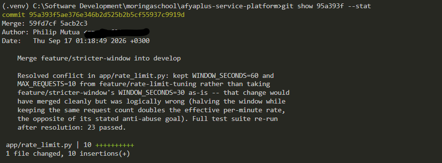
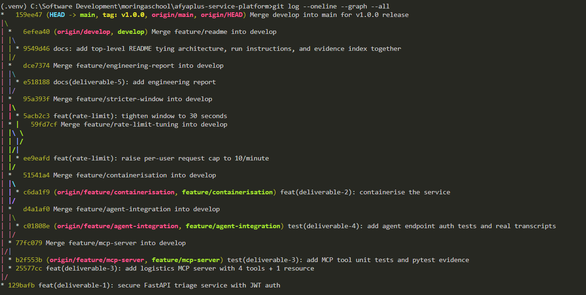

# Deliverable 5 — resolved merge conflict, in full

Two feature branches were cut from the same commit on `develop`
(`51541a4`) and both edited `app/rate_limit.py`'s two constants for
different, independently legitimate reasons:

- `feature/rate-limit-tuning` raised `MAX_REQUESTS` 5 -> 10 (coordinators
  triaging a queue of patients were hitting the old cap mid-shift).
- `feature/stricter-window` tightened `WINDOW_SECONDS` 60 -> 30 (a
  burst-abuse report suggested a full minute was too forgiving).

`feature/rate-limit-tuning` merged into `develop` cleanly first. Merging
`feature/stricter-window` second produced a real conflict on the same two
lines.

## The graph



Both feature branches were cut from the same commit (`51541a4`) on
`develop`. `feature/rate-limit-tuning` merged in cleanly first
(`59fd7cf`); merging `feature/stricter-window` second (`95a393f`) hit a
real conflict because both branches touched the same two lines in
`app/rate_limit.py`. See `screenshots/d5-01-git-log-graph-gitflow.png` for
the real `git log --oneline --graph --all` output this diagram mirrors,
and `screenshots/d5-02-resolved-merge-conflict-commit.png` for the
`git show 95a393f --stat` output below.

## The conflict, as git reported it

```
$ git merge --no-ff feature/stricter-window -m "Merge feature/stricter-window into develop"
Auto-merging app/rate_limit.py
CONFLICT (content): Merge conflict in app/rate_limit.py
Automatic merge failed; fix conflicts and then commit the result.
```

```python
<<<<<<< HEAD
WINDOW_SECONDS = 60
MAX_REQUESTS = 10  # raised from 5: coordinators triaging a queue of patients hit the old limit mid-shift
=======
WINDOW_SECONDS = 30  # tightened from 60: a burst-abuse report showed a full minute was too forgiving
MAX_REQUESTS = 5
>>>>>>> feature/stricter-window
```

## Why this isn't a "take theirs" resolution

Per `CONTRIBUTING.md`'s own rule — read both sides, don't take "ours" or
"theirs" wholesale — the two changes were evaluated together rather than
picked between. `feature/stricter-window`'s change would have merged
*cleanly* if it had touched different lines, but it is arithmetically
wrong on its own stated goal: halving the window while keeping the same
request count **doubles** the effective per-minute throughput (5 requests
every 30s = 10/min, versus the original 5/min) — the opposite of "too
forgiving, tighten it."

Resolution: kept `WINDOW_SECONDS = 60` and `MAX_REQUESTS = 10` (the
workflow fix, which is sound), and left a comment explaining why the
abuse-report concern was **not** folded in as a smaller window — it needs
an actual burst-detection fix, tracked separately, not a number that looks
stricter but isn't.

```python
# Conflict resolution (feature/rate-limit-tuning x feature/stricter-window):
# both branches touched these two lines for different, legitimate reasons.
# Taking "theirs" (WINDOW_SECONDS=30, MAX_REQUESTS=5) wholesale would have
# been wrong even though it merges cleanly: halving the window while
# keeping the same count DOUBLES the effective per-minute rate (5 req /
# 30s = 10/min) -- the opposite of the burst-abuse fix it was meant to be.
# Kept the 60-second window and the coordinator-workflow branch's raised
# cap; the abuse-report concern needs a real fix (burst detection within
# the window, not a smaller window) and is tracked separately rather than
# folded in here as a silently-wrong number.
WINDOW_SECONDS = 60
MAX_REQUESTS = 10  # raised from 5: coordinators triaging a queue of patients hit the old limit mid-shift
```

## Proof the resolution actually works, not just merges

Per `CONTRIBUTING.md`: "run the service and prove it still behaves
correctly before committing the resolution."

```
$ pytest tests/ -q
.......................                                                  [100%]
23 passed in 4.54s
```



## The merge commit

```
$ git show 95a393f --stat
commit 95a393f5ae376e346b2d525b2b5cf55937c9919d
Merge: 59fd7cf 5acb2c3
Author: Philip Mutua <pmutua@live.com>

    Merge feature/stricter-window into develop

    Resolved conflict in app/rate_limit.py: kept WINDOW_SECONDS=60 and
    MAX_REQUESTS=10 from feature/rate-limit-tuning rather than taking
    feature/stricter-window's WINDOW_SECONDS=30 as-is -- that change would
    have merged cleanly but was logically wrong (halving the window while
    keeping the same request count doubles the effective per-minute rate,
    the opposite of its stated anti-abuse goal). Full test suite re-run
    after resolution: 23 passed.

 app/rate_limit.py | 10 ++++++++++
 1 file changed, 10 insertions(+)
```




