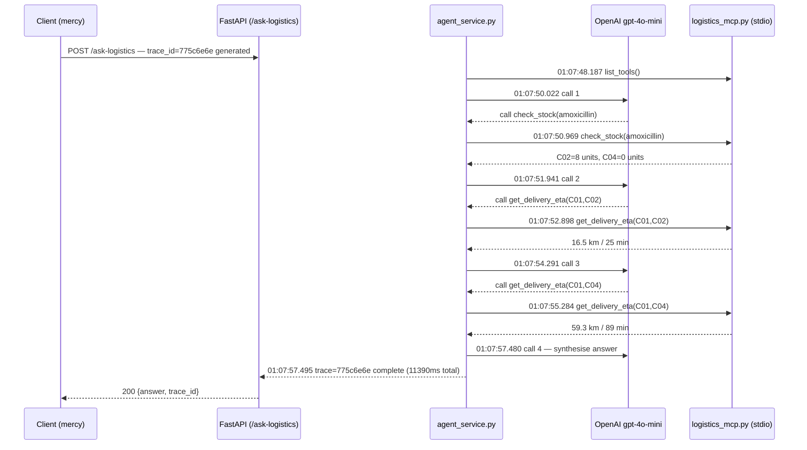

# Deliverable 5 — one request traced across API and tool logs

Reconstructing the multi-tool request from `evidence/agent_transcript.md`
(Question 1): *"Which clinics need an amoxicillin reorder, and what is the
ETA from Kisumu Central Clinic to the nearest one that needs it?"*,
`trace_id = 775c6e6e`.

## The trace as a sequence diagram



## How the trace is threaded

`app/main.py`'s `ask_logistics()` generates `trace_id` at the door
(`uuid4().hex[:8]`) and logs it once, at the end of the request, to
`logs/app.log`. That trace id is **not** passed down into
`mcp_server/logistics_mcp.py`'s per-tool log lines in `logs/mcp.log` — MCP's
tool-call protocol doesn't carry a caller-supplied id through to the tool
function, and adding that would need a custom tool-call interceptor
(out of scope here, and documented as such in `app/agent_service.py`
rather than silently overclaimed). What ties the two logs together instead
is **time**: `logs/app.log`'s single line for this request brackets a
window, and every `logs/mcp.log` line inside that window belongs to it —
true here because requests were run one at a time; a concurrent-request
version of this platform would need the real interceptor to keep that
property under load (see `docs/STAKEHOLDER_MEMO.md`'s risk section).

## logs/app.log — the request boundary

```
2026-09-17 01:07:50,022 HTTP Request: POST https://api.openai.com/v1/chat/completions "HTTP/1.1 200 OK"
2026-09-17 01:07:51,941 HTTP Request: POST https://api.openai.com/v1/chat/completions "HTTP/1.1 200 OK"
2026-09-17 01:07:54,291 HTTP Request: POST https://api.openai.com/v1/chat/completions "HTTP/1.1 200 OK"
2026-09-17 01:07:57,480 HTTP Request: POST https://api.openai.com/v1/chat/completions "HTTP/1.1 200 OK"
2026-09-17 01:07:57,495 trace=775c6e6e agent call complete
2026-09-17 01:07:57,495 route=/ask-logistics trace=775c6e6e user=mercy ms=11390 question_chars=123
```

Four LLM round-trips (the ReAct loop's think/observe steps) over
11.39 seconds, ending with the trace-complete line. The request started
around `01:07:46` (`11390ms` before the `01:07:57,495` completion line).

## logs/mcp.log — the same window

```
2026-09-17 01:07:48,187 Processing request of type ListToolsRequest
2026-09-17 01:07:50,968 Processing request of type CallToolRequest
2026-09-17 01:07:50,969 tool=check_stock item=amoxicillin
2026-09-17 01:07:50,972 Processing request of type ListToolsRequest
2026-09-17 01:07:52,897 Processing request of type CallToolRequest
2026-09-17 01:07:52,898 tool=get_delivery_eta from=C01 to=C02
2026-09-17 01:07:52,900 Processing request of type ListToolsRequest
2026-09-17 01:07:55,252 Processing request of type CallToolRequest
2026-09-17 01:07:55,284 tool=get_delivery_eta from=C01 to=C04
2026-09-17 01:07:55,287 Processing request of type ListToolsRequest
```

## The reconstructed sequence for trace 775c6e6e

| t (approx) | Where | What happened |
|---|---|---|
| 01:07:46 | `app/main.py` | `POST /ask-logistics` received, authenticated as `mercy`, `trace_id=775c6e6e` generated |
| 01:07:48.187 | `mcp_server/logistics_mcp.py` | MCP subprocess started, agent lists available tools |
| 01:07:50.022 | OpenAI | 1st model call: model decides to call `check_stock` |
| 01:07:50.969 | `mcp_server/logistics_mcp.py` | `tool=check_stock item=amoxicillin` — returns C02 (8 units) and C04 (0 units) as below threshold |
| 01:07:51.941 | OpenAI | 2nd model call: model reads the stock result, decides to call `get_delivery_eta` for the first low-stock clinic |
| 01:07:52.898 | `mcp_server/logistics_mcp.py` | `tool=get_delivery_eta from=C01 to=C02` |
| 01:07:54.291 | OpenAI | 3rd model call: model requests the second clinic's ETA too |
| 01:07:55.284 | `mcp_server/logistics_mcp.py` | `tool=get_delivery_eta from=C01 to=C04` |
| 01:07:57.480 | OpenAI | 4th model call: model has both ETAs, synthesises the final answer |
| 01:07:57.495 | `app/main.py` | `trace=775c6e6e agent call complete`; request logged, 11390ms total |

This matches the tool sequence a correct answer requires: stock lookup
first (to find *which* clinics need a reorder), then ETA lookups for each
candidate (in the order the model surfaced them) — exactly the two-tool
chain `evidence/agent_transcript.md` documents the final answer used.
