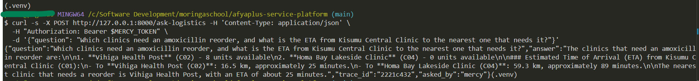
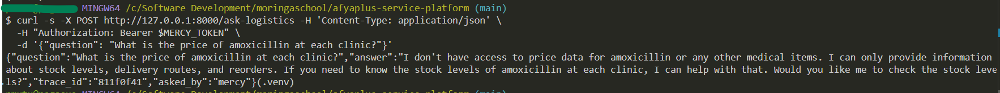
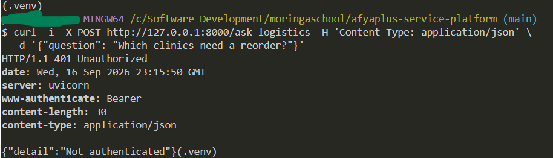
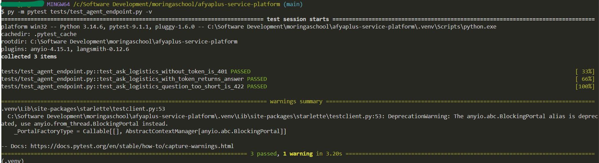

# Deliverable 4 — agent transcripts

Both calls below went through the real, authenticated, running service —
`POST /ask-logistics` behind `app.auth.current_user` (the same JWT
dependency `/triage` uses) — talking to a real `gpt-4o-mini` model and a
real MCP server subprocess (`mcp_server/logistics_mcp.py`). No stubs.

```
$ curl -s -X POST http://127.0.0.1:8000/token -H 'Content-Type: application/json' \
    -d '{"username": "mercy", "password": "logistics2026"}'
# -> access_token used as "Bearer <token>" below
```

## 1. Multi-tool success

**Question:** "Which clinics need an amoxicillin reorder, and what is the
ETA from Kisumu Central Clinic to the nearest one that needs it?"

This requires chaining two different tools: `check_stock` (to find which
clinics are low on amoxicillin) and `get_delivery_eta` (to compute travel
time to the nearest one) — the agent has to read the first tool's result
before it can decide the second tool's arguments.

```
$ curl -s -X POST http://127.0.0.1:8000/ask-logistics \
    -H 'Content-Type: application/json' \
    -H 'Authorization: Bearer <mercy token>' \
    -d '{"question": "Which clinics need an amoxicillin reorder, and what is the ETA from Kisumu Central Clinic to the nearest one that needs it?"}'

HTTP 200
{
  "question": "Which clinics need an amoxicillin reorder, and what is the ETA from Kisumu Central Clinic to the nearest one that needs it?",
  "answer": "The clinics that need an amoxicillin reorder are:\n\n1. **Vihiga Health Post** (C02) - 8 units\n2. **Homa Bay Lakeside Clinic** (C04) - 0 units\n\nThe estimated time of arrival (ETA) from Kisumu Central Clinic (C01) to the nearest clinic that needs a reorder (Vihiga Health Post) is approximately **25 minutes** (16.5 km away). \n\nThe ETA to the other clinic (Homa Bay Lakeside Clinic) is approximately **89 minutes** (59.3 km away).",
  "trace_id": "775c6e6e",
  "asked_by": "mercy"
}
```



Verified correct against `mcp_server/clinics.json`: C02 (8 units) and C04
(0 units) are the only clinics below the reorder threshold of 10, and
C01->C02 (16.5 km at 40 km/h) is indeed the nearer of the two ETAs the
agent computed. See `docs/TRACE_RECONSTRUCTION.md` for the full tool-call
sequence behind trace `775c6e6e`.

## 2. Honest failure

**Question:** "What is the price of amoxicillin at each clinic?"

No tool in `mcp_server/logistics_mcp.py` has price data — `check_stock`'s
own docstring says so explicitly, and `app/agent_service.py`'s system
prompt instructs the agent to say so rather than invent a number.

```
$ curl -s -X POST http://127.0.0.1:8000/ask-logistics \
    -H 'Content-Type: application/json' \
    -H 'Authorization: Bearer <mercy token>' \
    -d '{"question": "What is the price of amoxicillin at each clinic?"}'

HTTP 200
{
  "question": "What is the price of amoxicillin at each clinic?",
  "answer": "I don't have access to price data for amoxicillin or any other medical items. I can only provide information about stock levels, delivery routes, and reorders. If you need to know the stock levels of amoxicillin at each clinic, please let me know!",
  "trace_id": "27bb6909",
  "asked_by": "mercy"
}
```



`logs/mcp.log` for this window shows only a `ListToolsRequest` and no
`CallToolRequest` — the agent inspected what was available and correctly
concluded no tool call would help, rather than guessing with one.

## 3. Auth is enforced on this route too

```
$ curl -i -X POST http://127.0.0.1:8000/ask-logistics -H 'Content-Type: application/json' \
    -d '{"question": "Which clinics need a reorder?"}'
HTTP/1.1 401 Unauthorized
{"detail":"Not authenticated"}
```



## 4. `pytest tests/test_agent_endpoint.py -v` — 3 offline tests


