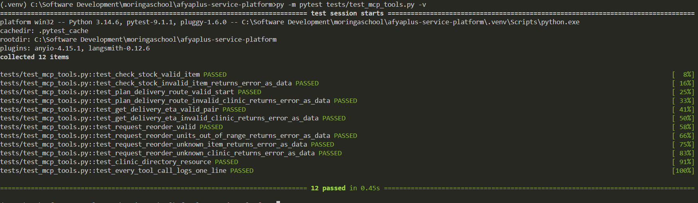
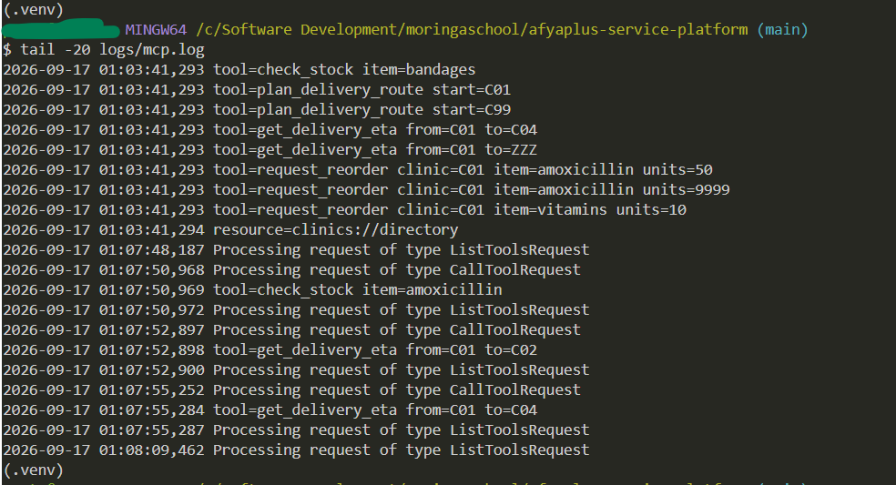

# Deliverable 3 — MCP server test evidence

Fallback path used per the brief ("No MCP Inspector: unit-test the tool
functions with pytest ... and paste the terminal evidence"): the MCP
Inspector requires an interactive browser session, so this capstone's
committed evidence is a headless pytest run against the tool functions
directly, run from the repo root.

## Command

```
pytest tests/test_mcp_tools.py -v
```

## Output

```
============================= test session starts =============================
platform win32 -- Python 3.14.6, pytest-9.1.1, pluggy-1.6.0
rootdir: C:\Software Development\moringaschool\afyaplus-service-platform
plugins: anyio-4.15.1, langsmith-0.12.6
collecting ... collected 12 items

tests/test_mcp_tools.py::test_check_stock_valid_item PASSED              [  8%]
tests/test_mcp_tools.py::test_check_stock_invalid_item_returns_error_as_data PASSED [ 16%]
tests/test_mcp_tools.py::test_plan_delivery_route_valid_start PASSED     [ 25%]
tests/test_mcp_tools.py::test_plan_delivery_route_invalid_clinic_returns_error_as_data PASSED [ 33%]
tests/test_mcp_tools.py::test_get_delivery_eta_valid_pair PASSED         [ 41%]
tests/test_mcp_tools.py::test_get_delivery_eta_invalid_clinic_returns_error_as_data PASSED [ 50%]
tests/test_mcp_tools.py::test_request_reorder_valid PASSED               [ 58%]
tests/test_mcp_tools.py::test_request_reorder_units_out_of_range_returns_error_as_data PASSED [ 66%]
tests/test_mcp_tools.py::test_request_reorder_unknown_item_returns_error_as_data PASSED [ 75%]
tests/test_mcp_tools.py::test_request_reorder_unknown_clinic_returns_error_as_data PASSED [ 83%]
tests/test_mcp_tools.py::test_clinic_directory_resource PASSED           [ 91%]
tests/test_mcp_tools.py::test_every_tool_call_logs_one_line PASSED       [100%]

============================= 12 passed in 0.44s ==============================
```



## Deliberate invalid calls and their instructive error responses

Three of the tools were called with intentionally bad input; each returns
an `"error"` key naming the valid options instead of raising:

```
check_stock("bandages")
  -> {"error": "Unknown item 'bandages'. Valid items: ['amoxicillin', 'ors_sachets', 'malaria_kits']"}

plan_delivery_route("C99")
  -> {"error": "Unknown clinic id 'C99'. Valid ids: ['C01', 'C02', 'C03', 'C04', 'C05']"}

request_reorder("C01", "amoxicillin", 9999)
  -> {"error": "units must be an integer between 1 and 500, got 9999"}
```

## Matching log lines (logs/mcp.log — one line per call)

```
2026-09-17 01:03:41,292 tool=check_stock item=amoxicillin
2026-09-17 01:03:41,293 tool=check_stock item=bandages
2026-09-17 01:03:41,293 tool=plan_delivery_route start=C01
2026-09-17 01:03:41,293 tool=plan_delivery_route start=C99
2026-09-17 01:03:41,293 tool=get_delivery_eta from=C01 to=C04
2026-09-17 01:03:41,293 tool=get_delivery_eta from=C01 to=ZZZ
2026-09-17 01:03:41,293 tool=request_reorder clinic=C01 item=amoxicillin units=50
2026-09-17 01:03:41,293 tool=request_reorder clinic=C01 item=amoxicillin units=9999
2026-09-17 01:03:41,293 tool=request_reorder clinic=C01 item=vitamins units=10
2026-09-17 01:03:41,294 resource=clinics://directory
```



## Manual verification with the real protocol (optional, supplementary)

The server also runs under the real MCP stdio protocol and can be driven
interactively:

```
npx @modelcontextprotocol/inspector python mcp_server/logistics_mcp.py
```

Node/npx is available in this environment; the pytest run above is the
evidence of record because it is headless and reproducible in CI.
